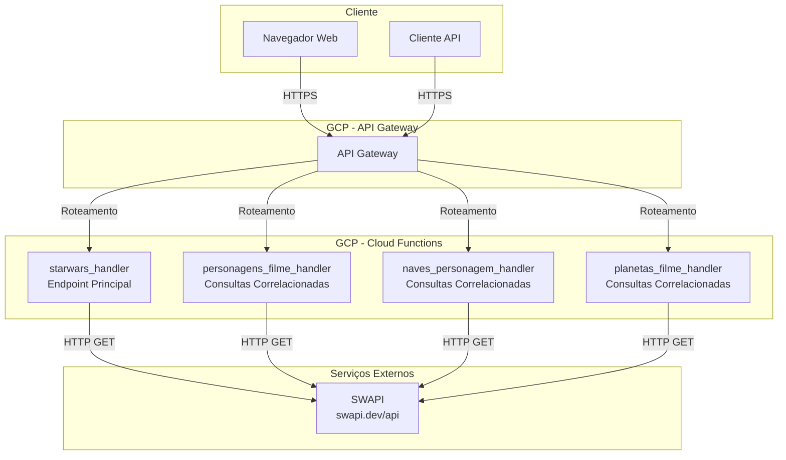
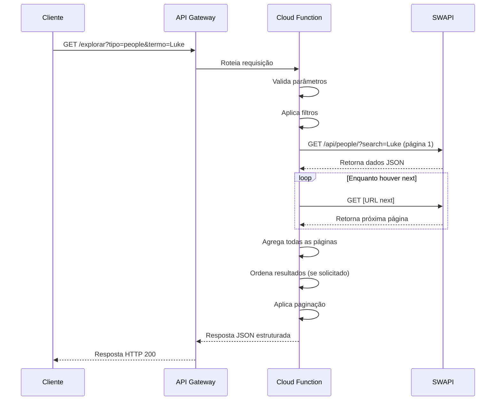
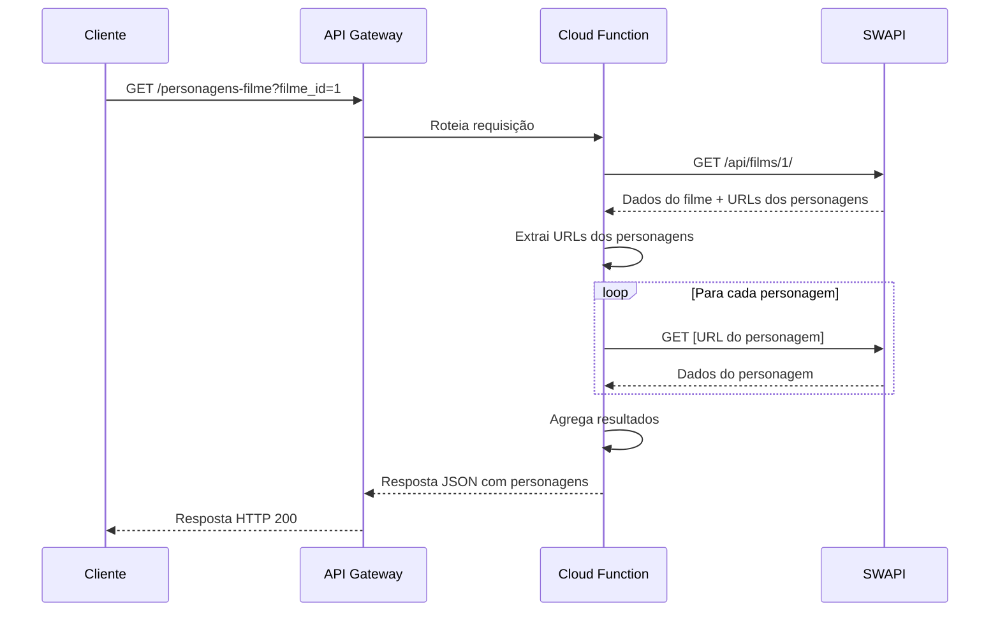

# Arquitetura Técnica - Star Wars API Explorer

## Visão Geral

Este documento descreve a arquitetura técnica da plataforma Star Wars API Explorer, desenvolvida no Google Cloud Platform (GCP) utilizando serviços serverless.

## Arquitetura do Sistema



## Fluxo de Requisições

### Fluxo Principal - Busca de Recursos



### Fluxo de Consultas Correlacionadas



## Componentes Principais

### 1. API Gateway (GCP)

**Responsabilidades:**
- Roteamento de requisições HTTP
- Gerenciamento de API
- Rate limiting (configurável)
- Autenticação (se implementada)
- Logging e monitoramento

**Configuração:**
- Especificação OpenAPI 2.0
- Endpoints configurados via `openapi2-functions.yaml`

### 2. Cloud Functions (GCP)

**Funções Implementadas:**

#### 2.1. `starwars_handler`
- **Endpoint:** `/explorar`
- **Método:** GET
- **Funcionalidades:**
  - Busca de recursos (people, planets, starships, films)
  - Filtros por termo de busca
  - Ordenação de resultados
  - Agregação de todas as páginas da SWAPI antes da paginação
  - Paginação de resultados
  - Validação de parâmetros
  - Tratamento de erros com retry

#### 2.2. `personagens_filme_handler`
- **Endpoint:** `/personagens-filme`
- **Método:** GET
- **Parâmetros:** `filme_id`
- **Funcionalidade:** Retorna todos os personagens de um filme específico

#### 2.3. `naves_personagem_handler`
- **Endpoint:** `/naves-personagem`
- **Método:** GET
- **Parâmetros:** `personagem_id`
- **Funcionalidade:** Retorna todas as naves de um personagem específico

#### 2.4. `planetas_filme_handler`
- **Endpoint:** `/planetas-filme`
- **Método:** GET
- **Parâmetros:** `filme_id`
- **Funcionalidade:** Retorna todos os planetas de um filme específico

### 3. Funções Auxiliares

#### 3.1. `fetch_from_swapi`
- Consulta a SWAPI com retry automático
- Implementa backoff exponencial
- Tratamento diferenciado de erros (4xx vs 5xx)
- Timeout configurável (10 segundos)

#### 3.2. `sort_results`
- Ordena resultados baseado em campo específico
- Suporta ordenação crescente/decrescente
- Tratamento de valores "unknown" e "n/a"
- Conversão automática de tipos (string/number)

#### 3.3. `apply_pagination`
- Aplica paginação aos resultados
- Validação de parâmetros de paginação
- Limite máximo de 100 itens por página

#### 3.4. `fetch_resource_by_url`
- Busca recurso específico pela URL completa
- Usado em consultas correlacionadas

#### 3.5. `fetch_swapi_url`
- Consulta uma URL completa da SWAPI (incluindo parâmetros de paginação)
- Reutiliza a mesma política de retry de `fetch_from_swapi`
- Usada para seguir o campo `next` retornado pela SWAPI

#### 3.6. `fetch_all_pages_swapi`
- Usa `fetch_from_swapi` para buscar a primeira página de resultados
- Usa `fetch_swapi_url` para seguir o campo `next` até o fim
- Agrega todos os itens em uma única lista
- Retorna a lista completa de resultados e o `count` total para o handler aplicar ordenação e paginação

## Decisões Técnicas

### 1. Escolha do GCP

**Justificativa:**
- Cloud Functions oferece escalabilidade automática
- Custo eficiente (pay-per-use)
- Integração nativa com outros serviços GCP
- API Gateway facilita gerenciamento e roteamento

### 2. Python como Linguagem Principal

**Justificativa:**
- Requisito do case técnico
- Bibliotecas robustas (requests, flask)
- Fácil integração com serviços GCP
- Código legível e manutenível

### 3. Arquitetura Serverless

**Vantagens:**
- Escalabilidade automática
- Sem necessidade de gerenciar servidores
- Custo baseado em uso
- Deploy simplificado

**Desvantagens:**
- Cold start (mitigado com configurações adequadas)
- Limite de tempo de execução (540s para HTTP functions)

### 4. Retry com Backoff Exponencial

**Implementação:**
- Máximo de 3 tentativas
- Delay inicial: 1 segundo
- Multiplicador exponencial: 2
- Delays: 1s, 2s, 4s

**Justificativa:**
- Melhora resiliência em caso de falhas temporárias
- Evita sobrecarga na API externa
- Padrão da indústria para sistemas distribuídos

### 5. Validação de Entrada Robusta

**Implementações:**
- Validação de tipos
- Validação de valores permitidos
- Sanitização de entrada (regex para prevenir injection)
- Limites de tamanho (máx. 100 caracteres para busca)

**Justificativa:**
- Segurança da aplicação
- Melhor experiência do usuário (mensagens de erro claras)
- Prevenção de erros em runtime

### 6. Logging Estruturado

**Implementação:**
- Biblioteca `logging` do Python
- Formato estruturado com timestamp
- Níveis apropriados (INFO, WARNING, ERROR)

**Justificativa:**
- Facilita debugging
- Monitoramento em produção
- Análise de performance e erros

### 7. CORS Habilitado

**Implementação:**
- Headers CORS configurados
- Suporte a OPTIONS (preflight)

**Justificativa:**
- Permite acesso via frontend web
- Necessário para aplicações client-side

## Estrutura de Dados

### Resposta Padrão - Endpoint Principal

```json
{
  "categoria": "people",
  "total_encontrado": 82,
  "total_na_pagina": 10,
  "pagina_atual": 1,
  "total_paginas": 9,
  "limite_por_pagina": 10,
  "resultados": [
    {
      "name": "Luke Skywalker",
      "height": "172",
      "mass": "77",
      ...
    }
  ]
}
```

### Resposta - Consultas Correlacionadas

```json
{
  "filme": {
    "titulo": "A New Hope",
    "episodio": 4,
    "data_lancamento": "1977-05-25"
  },
  "total_personagens": 18,
  "personagens": [...]
}
```

## Segurança

### Implementações Atuais

1. **Validação de Entrada**
   - Sanitização de parâmetros
   - Validação de tipos e formatos
   - Limites de tamanho

2. **CORS Configurado**
   - Headers apropriados
   - Suporte a preflight requests

3. **Tratamento de Erros**
   - Não exposição de informações sensíveis
   - Mensagens de erro genéricas para o cliente

### Melhorias Futuras

1. **Autenticação**
   - API Keys via GCP API Keys
   - OAuth 2.0 para acesso mais seguro

2. **Rate Limiting**
   - Configuração no API Gateway
   - Limites por IP/API Key

3. **HTTPS Obrigatório**
   - Configuração no API Gateway
   - Redirecionamento HTTP -> HTTPS

## Performance e Escalabilidade

### Otimizações Implementadas

1. **Retry Inteligente**
   - Evita retries desnecessários em erros 4xx
   - Backoff exponencial reduz carga

2. **Paginação**
   - Limita quantidade de dados transferidos
   - Melhora tempo de resposta

3. **Logging Eficiente**
   - Apenas informações necessárias
   - Não impacta performance

### Limitações e Considerações

1. **Cold Start**
   - Primeira requisição pode ter latência maior
   - Mitigado com configurações de min instances (se necessário)

2. **Dependência Externa (SWAPI)**
   - Performance depende da disponibilidade da SWAPI
   - Retry implementado para mitigar falhas temporárias

3. **Consultas Correlacionadas**
   - Múltiplas requisições HTTP sequenciais
   - Poderia ser otimizado com processamento paralelo (asyncio)

## Monitoramento e Observabilidade

### Logs

- Estruturados com timestamp, nível e mensagem
- Disponíveis no Cloud Logging do GCP
- Filtros por função, nível de log, timestamp

### Métricas (GCP Cloud Monitoring)

- Número de invocações
- Tempo de execução
- Taxa de erros
- Uso de memória

## Testes

### Estrutura de Testes

- **Framework:** pytest
- **Cobertura:** Testes unitários para todas as funções principais
- **Mocks:** unittest.mock para isolar dependências externas

### Tipos de Testes

1. **Testes Unitários**
   - Funções auxiliares (sort, pagination)
   - Lógica de validação
   - Tratamento de erros

2. **Testes de Integração**
   - Endpoints completos
   - Fluxos de requisição-resposta
   - Consultas correlacionadas

## Deploy e CI/CD

### Processo de Deploy Manual

1. Configurar projeto GCP
2. Habilitar APIs necessárias
3. Deploy da Cloud Function
4. Configurar API Gateway
5. Atualizar configurações do frontend

### Melhorias Futuras

1. **CI/CD Pipeline**
   - GitHub Actions ou Cloud Build
   - Deploy automático em push
   - Testes automatizados

2. **Ambientes**
   - Desenvolvimento
   - Staging
   - Produção

## Custos Estimados

### GCP Cloud Functions
- Primeiros 2 milhões de invocações: Grátis
- Após: $0.40 por milhão de invocações
- Computação: $0.0000025 por GB-segundo

### API Gateway
- Primeiros 1 milhão de requisições: Grátis
- Após: $3.00 por milhão de requisições

**Estimativa para uso moderado:** < $5/mês

## Conclusão

A arquitetura implementada é:
- **Escalável:** Serverless permite crescimento automático
- **Confiável:** Retry e tratamento de erros robustos
- **Segura:** Validação de entrada e boas práticas
- **Manutenível:** Código organizado, testado e documentado
- **Custo-efetiva:** Pay-per-use, sem custos fixos

Esta arquitetura atende aos requisitos do case técnico e pode ser facilmente expandida com funcionalidades adicionais conforme necessário.
