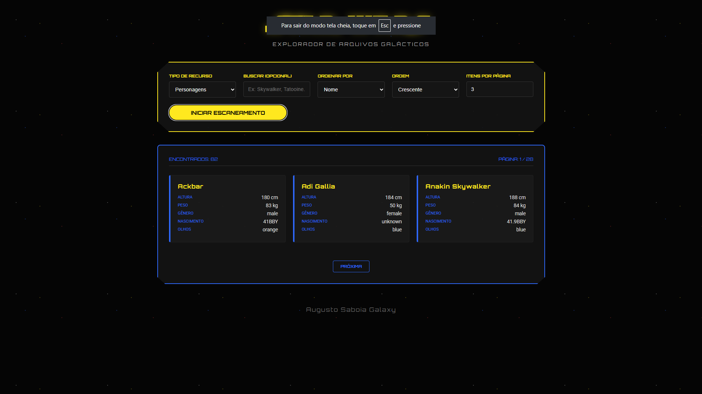

# Star Wars API Explorer

---

## 1. Como testar (instância já publicada)

Você não precisa subir nada para testar. Já existe uma instância publicada.

- **URL base do API Gateway:**

  `https://starwars-gateway-7mwhqkjo.uc.gateway.dev/`

### 1.1. Testar direto no navegador

Abra no navegador, por exemplo:

- Lista de personagens (página 1, 10 itens):

  `https://starwars-gateway-7mwhqkjo.uc.gateway.dev/explorar?tipo=people&pagina=1&limite=10`
- Buscar por “Luke”:

  `https://starwars-gateway-7mwhqkjo.uc.gateway.dev/explorar?tipo=people&termo=Luke`

Você verá o JSON retornado pela API.

### 1.2. Testar com o frontend deste projeto

1. Abra o arquivo `frontend/index.html` em um editor.
2. Confira a linha onde está a `API_BASE_URL`:

   const API_BASE_URL = 'https://starwars-gateway-7mwhqkjo.uc.gateway.dev/';
